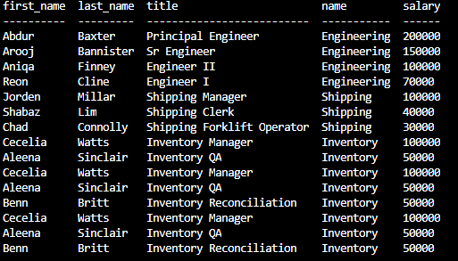
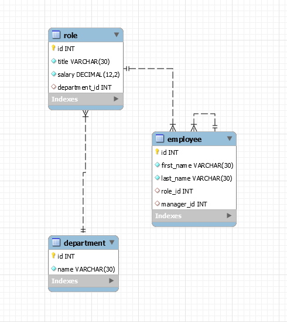

# ch12-employeemanagesys

## Table of Contents

* [Description](#description)
* [Usage](#usage)
* [Credit](#credit)
* [Criteria](#criteria)
* [Questions](#questions)

## Description

This project is a command-line operated employee management system. The user can add a department, role, or an emloyee, along with relevant data. The information gets added to the database, and the user can then view a table of all the departments, roles, or employees and relevant information. The user has the option to update the role of an employee as well.

```
As a business owner
I want to be able to view and manage the departments, roles, and employees in my company
So that I can organize and plan my business
```

## Usage

To access the repo, go to https://github.com/ngkent75/ch12-employeemanagesys


1. Open up your terminal and run npm start.
2. Select ADD to make any additions. Then select what you would like to add and the necessary information that follows. The terminal will reset.
3. To view what is inside your database, navigate to VIEW in the terminal and select what you would like to see. A table will then appear showing the data. The terminal will reset.
4. If you would like to edit the role of an employee, navigate to UPDATE ROLE in your, select the employee, and pick what role you would like to use from the list. The terminal will reset.
5. Navigate to EXIT when finished to terminate the program.

When viewing a table, it should look like this:



Here is a generated flowchart showing a reverse engineering of the database:




## Credit

Markdown documentation: https://guides.github.com/features/mastering-markdown/#syntax

Inquirer documentation: https://www.npmjs.com/package/inquirer

console.table documentation: https://www.npmjs.com/package/console.table

Recording software: https://www.screencastify.com/

MySQL: https://www.mysql.com/

## Criteria

* The command-line application should allow users to:

  * Add departments, roles, employees

  * View departments, roles, employees

  * Update employee roles


## Questions
Have any questions? Feel free to reach out.

GitHub: [ngkent75](https://github.com/ngkent75)

Email: [ngkent75@gmail.com](mailto:ngkent75@gmail.com)